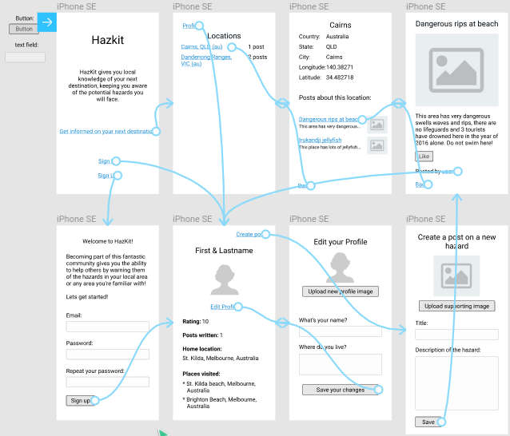

# HazKit

## User Stories

[Trello board](https://trello.com/b/RUE22nsZ/outdoor-adventuretour-hazard-app)

## ERD

## Wireframing

[Figma link here](https://www.figma.com/file/ZzK8wDqYHfflCzlaXwa94JZI/TourHazardApp)

## Challenges

* Work allocation - could have been more modularised, one person doing the wireframing/front-end, one sorting out the models + database, and som

* Bootstrap - a greater familiarity with it across the team would have sped up development

## Features to be implemented

* APIs/iFrames: Omniauth - logging in via fbook, google maps for locations

* Searching function for locations

* A button on each location show page, marking that the location is visited by the current user. Would be added to their profile