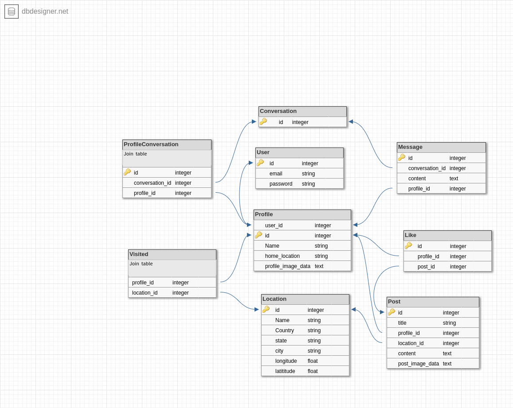

# HazKit

## User Stories

[Trello board](https://trello.com/b/RUE22nsZ/outdoor-adventuretour-hazard-app)

## ERD

## Wireframing

## GEMs/APIs

* Geocoder - maps
* Omniauth - logging in via fbook, google APIs for instance